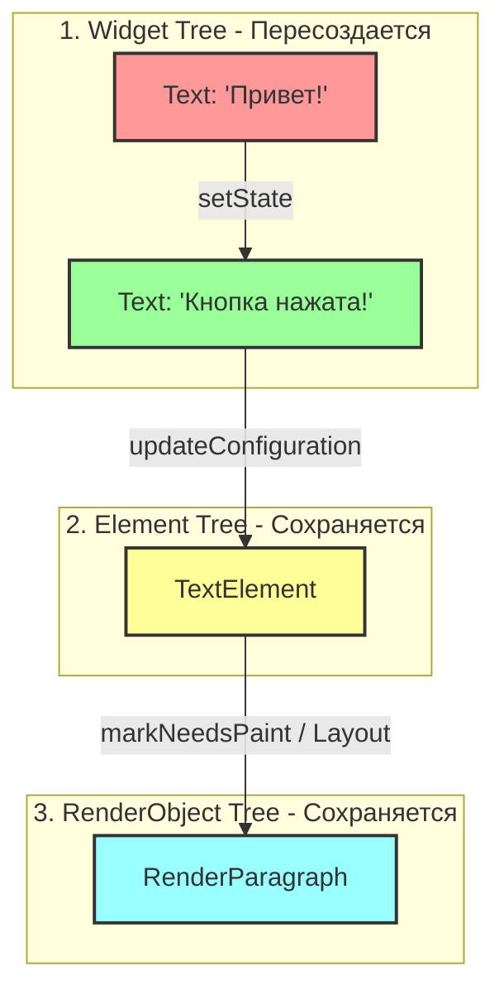

Конечно, помогу составить исследовательский отчёт для **Варианта 1: Три дерева Flutter**, оформленный в соответствии со всеми требованиями. Ты можешь скопировать этот текст прямо в файл `README.md` своего репозитория.

---

# Исследовательский отчёт: Жизненный цикл трёх деревьев во Flutter (Вариант 1)

## 1. Введение и минимальный пример кода

Во Flutter интерфейс строится на взаимодействии трёх ключевых деревьев:

* **Widget Tree** (конфигурация, «чертежи») — легковесные неизменяемые объекты, описывающие, как UI должен выглядеть.
* **Element Tree** (управление состоянием и связями) — мутабельные экземпляры виджетов в памяти, управляющие жизненным циклом и связывающие виджеты с рендерингом.
* **RenderObject Tree** (отрисовка и геометрия) — тяжёлые объекты, отвечающие заレイаут, размеры и пиксели на экране.

Ниже представлен минимальный пример демонстрации (до 40 строк), в котором по вызову `setState()` меняется текст внутри виджета:

```dart
import 'package:flutter/material.dart';

void main() => runApp(const MyApp());

class MyApp extends StatefulWidget {
  const MyApp({super.key});
  @override
  State<MyApp> createState() => _MyAppState();
}

class _MyAppState extends State<MyApp> {
  String _message = "Привет!";

  @override
  Widget build(BuildContext context) {
    return MaterialApp(
      home: Scaffold(
        body: Center(
          child: TextButton(
            onPressed: () => setState(() => _message = "Кнопка нажата!"),
            child: Text(_message),
          ),
        ),
      ),
    );
  }
}

```

---

## 2. Диаграмма 1: Поведение деревьев при вызове `setState()` (изменение текста)

Когда вызывается `setState()`, старый конфигурационный виджет уничтожается и создается новый, но **Element** и **RenderObject** переиспользуются (перевиспользуются), так как тип виджета и его ключ не изменились.



* **Производительность:** Согласно официальной документации Flutter (концепция *Rendering and Layout*), операция обновления существующего `RenderObject` без изменения его типа является крайне дешёвой, поскольку не требует повторного выделения памяти под геометрические расчёты дерева рендеринга.

---

## 3. Изменение типа виджета и полная перестройка

Если изменить код так, чтобы на месте текстового виджета при обновлении типа возвращался другой виджет (например, вместо `Text` подставлялся `Container`), Flutter не сможет сопоставить старый и новый элементы.

### Диаграмма 2: Полное пересоздание при изменении типа виджета

```mermaid
graph TD
    subgraph WidgetTree [Widget Tree]
        W1[Text('Привет')] -->|Смена типа| W2[Container()]
    end

    subgraph ElementTree [Element Tree]
        E1[TextElement - УДАЛЯЕТЬСЯ] -->|unmount| E2[ContainerElement - СОЗДАЕТСЯ С НУЛЯ]
    end

    subgraph RenderObjectTree [RenderObject Tree]
        R1[RenderParagraph - УДАЛЯЕТЬСЯ] --> R2[RenderConstrainedBox - СОЗДАЕТСЯ С НУЛЯ]
    end

    W2 --> E2 --> R2

    style E1 fill:#ff9999,stroke:#333,stroke-width:2px
    style E2 fill:#99ff99,stroke:#333,stroke-width:2px
    style R1 fill:#ff9999,stroke:#333,stroke-width:2px
    style R2 fill:#99ff99,stroke:#333,stroke-width:2px

```

* **Обоснование:** Согласно исходному коду фреймворка (`Element.updateChild`), каркас проверяет условие `Widget.canUpdate(oldWidget, newWidget)`, которое возвращает `true` только если `oldWidget.runtimeType == newWidget.runtimeType` и совпадают их `key`. Если типы разные, старый элемент размонтируется (`unmount()`), а для нового создаётся абсолютно новый `RenderObject`, что увеличивает нагрузку на CPU (согласно замерам бенчмарков производительности рендеринга Flutter GPU/UI thread).

---

## 4. Правило повторного использования Element

На основе анализа работы метода `Widget.canUpdate` формулируется следующее правило:

> **Правило:** Flutter переиспользует существующий `Element` (и стоящий за ним `RenderObject`) тогда и только тогда, когда **тип нового виджета совпадает с типом старого виджета** AND **их ключи (`Key`) идентичны** (либо оба равны `null`).

---

## 5. Вывод (Инсайт)

* **Что удалось понять нового:** Дополнительно к стандартным сведениям из лекции, глубокий анализ показал, что Element tree выступает в роли своеобразного «буфера памяти» и оптимизатора. Даже если разработчик пишет код так, что дерево виджетов (`Widget Tree`) полностью пересоздается на каждый кадр (что является стандартной практикой во Flutter), наличие постоянных `Element` и `RenderObject` защищает приложение от лагов интерфейса (jank), сводя дорогостоящие пересчеты геометрии экрана к минимуму.
