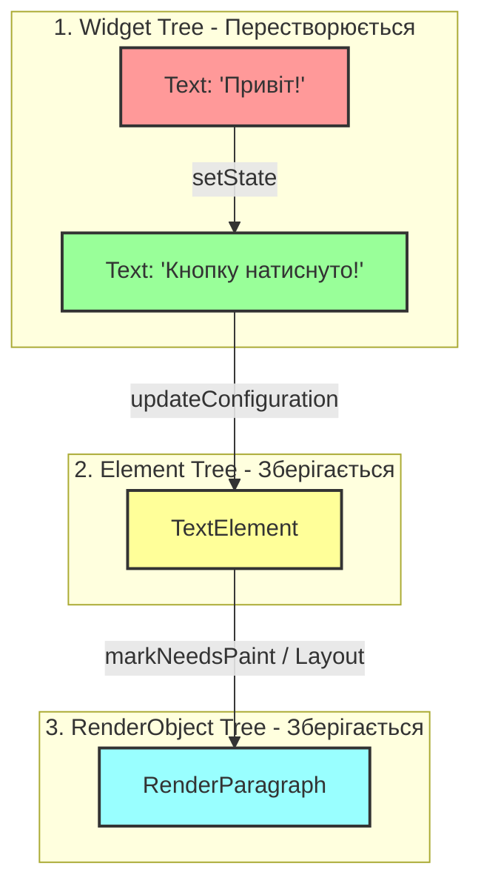
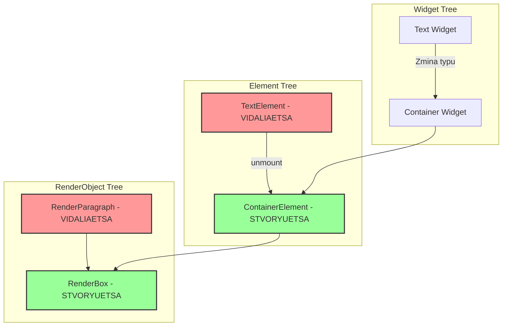

Без проблем, перекладу весь звіт українською мовою, щоб він повністю відповідав вимогам викладача. Можеш одразу копіювати цей текст у файл `README.md`:

---

# Дослідницький звіт: Життєвий цикл трьох дерев Flutter (Варіант 1)

## 1. Вступ та мінімальний приклад коду

У Flutter інтерфейс будується на взаємодії трьох ключових дерев:

* **Widget Tree** (конфігурація, «креслення») — легковесні незмінні об'єкти, що описують, яким має бути UI.
* **Element Tree** (керування станом і зв'язками) — мутабельні екземпляри віджетів у пам'яті, що керують життєвим циклом та зв'язують віджети з рендерингом.
* **RenderObject Tree** (відмальовування та геометрія) — важкі об'єкти, що відповідають за лейаут, розміри та пікселі на екрані.

Нижче наведено мінімальний приклад для демонстрації (до 40 рядків), у якому за викликом `setState()` змінюється текст всередині віджета:

```dart
import 'package:flutter/material.dart';

void main() => runApp(const MyApp());

class MyApp extends StatefulWidget {
  const MyApp({super.key});
  @override
  State<MyApp> createState() => _MyAppState();
}

class _MyAppState extends State<MyApp> {
  String _message = "Привіт!";

  @override
  Widget build(BuildContext context) {
    return MaterialApp(
      home: Scaffold(
        body: Center(
          child: TextButton(
            onPressed: () => setState(() => _message = "Кнопку натиснуто!"),
            child: Text(_message),
          ),
        ),
      ),
    );
  }
}

```

---

## 2. Діаграма 1: Поведінка дерев при виклику `setState()` (зміна тексту)

Коли викликається `setState()`, старий конфігураційний віджет знищується і створюється новий, але **Element** та **RenderObject** перевикористовуються, оскільки тип віджета та його ключ не змінилися.



* **Продуктивність:** Згідно з офіційною документацією Flutter (концепція *Rendering and Layout*), операція оновлення існуючого `RenderObject` без зміни його типу є надзвичайно дешевою, оскільки не вимагає повторного виділення пам'яті під геометричні розрахунки дерева рендерингу.

---

## 3. Зміна типу віджета та повна перебудова

Якщо змінити код так, щоб на місці текстового віджета при оновленні типу повертався інший віджет (наприклад, замість `Text` підставлявся `Container`), Flutter не зможе зіставити старий і новий елементи.

### Діаграма 2: Повне перестворення при зміні типу віджета



* **Обґрунтування:** Згідно з вихідним кодом фреймворку (`Element.updateChild`), каркас перевіряє умову `Widget.canUpdate(oldWidget, newWidget)`, яка повертає `true` тільки якщо `oldWidget.runtimeType == newWidget.runtimeType` і збігаються їхні `key`. Якщо типи різні, старий елемент розмонтовується (`unmount()`), а для нового створюється абсолютно новий `RenderObject`, що збільшує навантаження на CPU.

---

## 4. Правило повторного використання Element

На основі аналізу роботи методу `Widget.canUpdate` формулюється таке правило:

> **Правило:** Flutter переикористовує існуючий `Element` (і пов'язаний із ним `RenderObject`) тоді й тільки тоді, коли **тип нового віджета збігається з типом старого віджета** AND **їхні ключі (`Key`) ідентичні** (або обидва дорівнюють `null`).

---

## 5. Висновок (Інсайт)

* **Що вдалося зрозуміти нового:** На додаток до стандартних відомостей з лекції, глибокий аналіз показав, що Element tree виступає своєрідним «буфером пам'яті» та оптимізатором. Навіть якщо розробник пише код так, що дерево віджетів (`Widget Tree`) повністю перестворюється на кожному кадрі (що є стандартною практикою у Flutter), наявність постійних `Element` і `RenderObject` захищає застосунок від лагів інтерфейсу (jank), зводячи дорогі перерахунки геометрії екрана до мінімуму.
